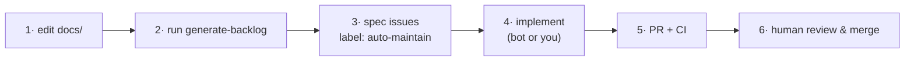

# Contributing

Thanks for contributing! This project is **docs-first**: behaviour is described
in `docs/`, and code is generated/implemented from there. You don't hand-write a
tracker — you edit docs and let `generate-backlog` file the spec issues.



Nothing merges automatically — a human always reviews the pull request.

---

## 1. Describe the behaviour in `docs/`

The source of truth is `docs/`, especially
[`docs/02-agent-harness.md`](docs/02-agent-harness.md), where each capability is
tagged ✅ **Implemented** or 🚧 **Planned**.

To propose new behaviour:

1. Add (or edit) a capability entry. Mark it 🚧 **Planned** and give it:
   - a short imperative title,
   - the user-facing behaviour,
   - an **acceptance-criteria checklist**.
2. Keep each capability **small and independently shippable** — one capability
   should map to one issue and one PR.
3. Open a PR with just the doc change. Once it merges to `main`, the pipeline
   can pick it up.

> Doc-only pushes under `docs/**` also trigger `generate-backlog` automatically.

## 2. Generate the spec backlog

Turn the docs into issues with the **Generate Backlog from Docs** workflow. It
files one issue per 🚧 capability (labels `spec` + `auto-maintain`).

It has a **memory**: `specs/backlog-state.json` records a `sha256` per doc, so
each run only processes docs that are **new or changed** and never re-files what
it has already seen. A push under `docs/**` triggers it automatically; you can
also run it manually.

**Preview first (dry run — creates nothing, doesn't touch the state file):**

```bash
gh workflow run "Generate Backlog from Docs" -f dry_run=true
# watch it:
gh run watch "$(gh run list --workflow 'Generate Backlog from Docs' \
  --limit 1 --json databaseId -q '.[0].databaseId')"
```

**Create the issues for real** (only new/changed docs are processed):

```bash
gh workflow run "Generate Backlog from Docs"
```

**Reprocess everything, ignoring the memory** (e.g. after editing many docs):

```bash
gh workflow run "Generate Backlog from Docs" -f force=true
```

Or from the UI: **Actions → Generate Backlog from Docs → Run workflow**.

> The memory is deterministic and lives in a `detect` job (sha256 diff); Claude
> only ever sees the changed docs, and a `persist` job commits the updated state.

## 3. Implement an issue

Two paths — both end in a PR against `main`:

### a) Let the agent do it
Add the **`auto-maintain`** label to the issue (generated issues already have
it). That triggers **Auto-Maintain (Issue → PR)**, which:
- reads the issue + `CLAUDE.md`,
- implements it on branch `auto/issue-<n>`,
- works test-first (TDD) and runs `cargo fmt` / `build` / `clippy` / `test`,
- opens a PR (`Closes #<n>`).

You can also trigger it manually:

```bash
gh workflow run "Auto-Maintain (Issue → PR)" -f issue_number=<n>
```

### b) Do it yourself (test-first)
```bash
git checkout -b auto/issue-<n>
# TDD: write the failing test(s) first, then implement.
cargo fmt --all
cargo build --all-targets
cargo clippy --all-targets -- -D warnings
cargo test --all-targets
git commit -am "Implement #<n>: <title>"
gh pr create --fill
```

## 4. Coding conventions

All code — human or agent — must follow [`CLAUDE.md`](CLAUDE.md). In short:

- **Functional core.** No global mutable state, no `unsafe`, no panics on the
  happy or error path. "Mutation" returns new values (`Conversation::with`).
- **The `Planner` is the only LLM seam.** Keep `agent` / `harness` / `tool` /
  `message` free of I/O.
- **Errors are values** (`Result` + `ToolError`); no `unwrap`/`expect` outside
  tests.
- **Zero third-party dependencies** unless a spec explicitly requires one.

## 5. Definition of done

A PR is ready to merge when:

1. Behaviour matches the doc's acceptance criteria.
2. It was built **test-first (TDD)** — tests written before implementation.
3. `cargo fmt --all -- --check` passes.
4. `cargo build --all-targets` passes.
5. `cargo clippy --all-targets -- -D warnings` passes.
6. `cargo test --all-targets` passes.
7. The capability in `docs/02-agent-harness.md` is flipped from
   🚧 **Planned** to ✅ **Implemented** **in the same PR** — otherwise
   `generate-backlog` will keep re-filing it.

CI (`ci.yml`) enforces 3–6 on every PR.

## Local development

```bash
cargo run            # run the demo agent, print a transcript
cargo fmt --all      # format
cargo build --all-targets
cargo clippy --all-targets -- -D warnings
cargo test --all-targets   # write tests first (TDD)
```

## Reporting bugs / ideas without code

Open a normal issue. If it should change product behaviour, the durable home for
it is a `docs/` edit (see step 1) so the backlog stays the single source of
truth.
