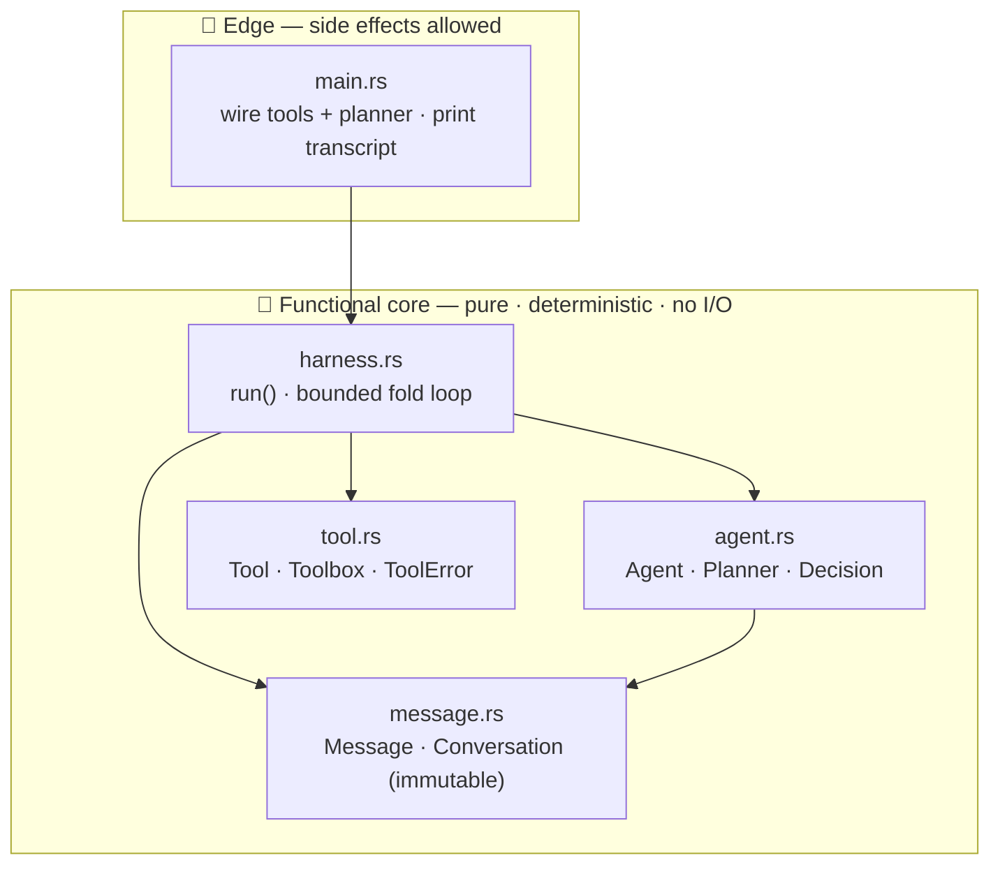
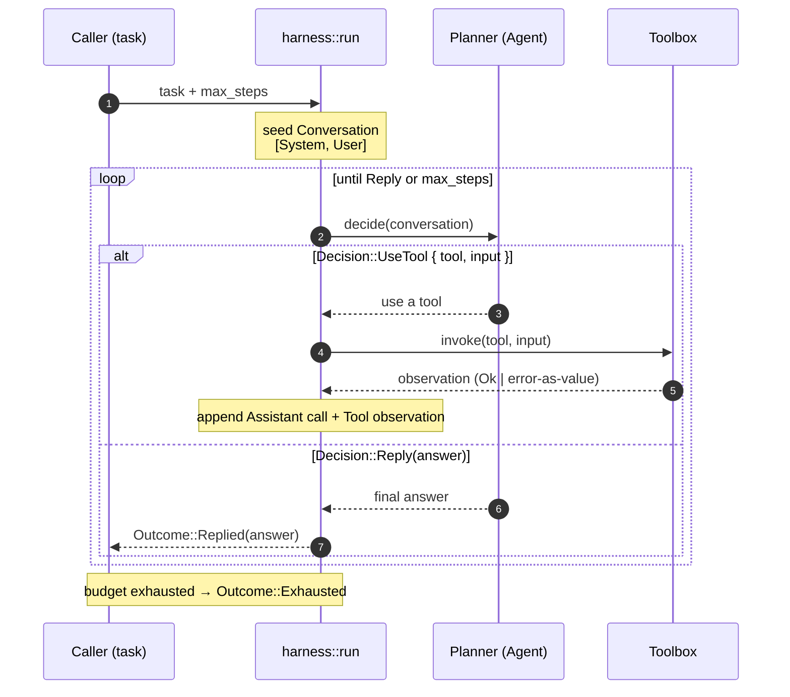
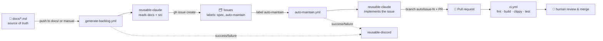

# code-from-docs

A demo of **doc-driven code generation** with GitHub Actions and Claude Code.

You keep the spec in `docs/`. One workflow turns the docs into a GitHub issue
backlog; another picks up each issue, writes the code on a branch, and opens a
pull request for you to review. The thing being built is a small **functional
agent harness** in Rust (`src/`) — small enough to watch the whole loop work.

```
edit docs/ ──▶ generate-backlog ──▶ GitHub issues ──▶ auto-maintain ──▶ pull requests ──▶ you review & merge
```

## Repository layout

```
.
├── docs/                     # SOURCE OF TRUTH — what the app should do
│   ├── 00-vision.md
│   ├── 01-architecture.md
│   ├── 02-agent-harness.md   # capability specs (Implemented / Planned)
│   └── 03-roadmap.md
├── src/                      # the Rust harness (the demo target)
│   ├── message.rs            # immutable Conversation
│   ├── tool.rs               # pure tools + registry
│   ├── agent.rs              # planner + agent
│   ├── harness.rs            # the bounded fold loop
│   ├── lib.rs
│   └── main.rs               # runnable demo
├── tests/                    # behavioural tests
├── specs/
│   └── backlog-state.json    # MEMORY: sha256 per doc already turned into issues
├── CLAUDE.md                 # conventions the coding agent must follow
├── .env.example              # required secret NAMES (no values)
├── .github/prompts/          # the prompts sent to Claude — edit these, not YAML
│   ├── implement-issue.md    # auto-maintain's prompt
│   └── generate-backlog.md   # generate-backlog's prompt
└── .github/workflows/
    ├── generate-backlog.yml  # caller: docs  → issues (detect · backlog · persist)
    ├── docs-watch.yml        # on push to docs/**, dispatches generate-backlog
    ├── auto-maintain.yml     # caller: issue → PR (+ comments session cost)
    ├── ci.yml                # quality gate: fmt · build · clippy · test on every PR
    ├── reusable-claude.yml   # reusable: runs claude-code-action headlessly (outputs cost)
    ├── reusable-notify.yml   # reusable: success/failure notification (wraps discord)
    ├── reusable-discord.yml  # reusable: Discord notifications
    └── reusable-pr-comment.yml  # reusable: posts a comment on a PR
```

## Harness architecture

The Rust crate is a **functional-core** agent harness: the core is pure and
deterministic (no I/O, no mutation), and every side effect lives at the edge in
`main.rs`. The single place a real LLM would plug in is the `Planner` — a plain
`fn(&Conversation) -> Decision`.

### Modules & dependencies



### The run loop

`run(agent, tools, task, max_steps)` seeds a conversation and folds one
`Decision` at a time. Tool results become observations fed back to the planner;
the loop stops on `Reply` or when the step budget is spent (`Exhausted`).



## How the workflows fit together

The pipeline is split into **reusable** building blocks and thin **caller**
workflows that only orchestrate:




| Workflow | Trigger | Does |
|----------|---------|------|
| `generate-backlog.yml` | manual, or dispatched by `docs-watch` | hashes docs vs `specs/backlog-state.json` (memory), files one issue per **new/changed** Planned capability, commits updated state |
| `docs-watch.yml` | push to `docs/**` | translates the push into a `workflow_dispatch` of `generate-backlog` (the Claude action rejects raw `push` events) |
| `auto-maintain.yml` | issue labelled `auto-maintain`, or manual | runner branches `auto/issue-<n>` from `main` and formats/commits/pushes (git, not AI); Claude only writes code + tests; then opens a PR and comments the Claude **session cost** |
| `ci.yml` | every PR + push to `main` | `cargo fmt --check`, `cargo build`, `clippy -D warnings`, `cargo test` — the gate for auto-generated PRs |
| `reusable-claude.yml` | `workflow_call` | checkout + `anthropics/claude-code-action@v1` (headless); reads the prompt from `prompt_file` (vars via `session_env`), optionally branches from `main`/formats/pushes, outputs `cost_usd`/`num_turns` |
| `reusable-notify.yml` | `workflow_call` | maps a `success`/`failure` outcome to a standardized title/message and calls `reusable-discord` (used once per workflow with `if: always()`) |
| `reusable-discord.yml` | `workflow_call` | posts a success/failure embed to a Discord webhook |
| `reusable-pr-comment.yml` | `workflow_call` | posts a Markdown comment on a PR (auto-maintain uses it to report cost) |

Callers invoke the reusables with `uses:` and pass credentials with
`secrets: inherit`, so **no secret is ever written into a workflow file**.
Each caller declares least-privilege `permissions:` (backlog = `issues: write`
only; auto-maintain = `contents`/`issues`/`pull-requests: write`).

## Setup

1. **Push this repo to GitHub** and install the
   [Claude GitHub App](https://github.com/apps/claude) on it.
2. **Add repository secrets** (Settings → Secrets and variables → Actions).
   See [`.env.example`](.env.example) for the exact names:
   - `CLAUDE_CODE_OAUTH_TOKEN` — from `claude setup-token`.
   - `DISCORD_WEBHOOK_URL` — a Discord Incoming Webhook.
3. **Generate the backlog:** Actions → *Generate Backlog from Docs* → *Run
   workflow* (tick *dry run* first to preview). Issues appear labelled `spec`
   and `auto-maintain`.
4. **Let it code:** adding the `auto-maintain` label triggers
   *Auto-Maintain (Issue → PR)*, which opens a PR. Review and merge.

Nothing merges automatically — humans hold the merge button.

## Using this in your own repo

This repo is a portable template. To wire the same pipeline into another project
(any language), follow **[ADOPTING.md](ADOPTING.md)** — it lists which files to
copy, what to change per repo, and the non-obvious gotchas already solved.

## Run the demo locally

```bash
cargo run            # prints a transcript from the demo agent
cargo test           # behavioural tests
cargo clippy --all-targets -- -D warnings
```

## Contributing

Contributions are **docs-first**: you describe behaviour in `docs/`, let
`generate-backlog` turn it into spec issues, and let `auto-maintain` (or a
human) implement them. The full workflow — including how to run the backlog
generator — is in **[CONTRIBUTING.md](CONTRIBUTING.md)**. Coding conventions the
agent (and you) must follow live in [CLAUDE.md](CLAUDE.md).
